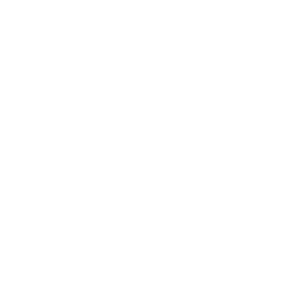

<div align="center">
  
  <h1>Rayban | رایبان</h1>
  <p>وب‌سایت معرفی پروژه‌ها و تخصص‌های رایبان، با پنل مدیریت محتوا</p>
  <p>React · TypeScript · Vite · Three.js · Node.js</p>
</div>

رایبان یک وب‌سایت فارسی و انگلیسی برای معرفی فعالیت‌های نرم‌افزاری، هوش مصنوعی، زیرساخت و طراحی تجربه کاربری است. پروژه‌ها، اعضای تیم و راه‌های ارتباطی در بخش عمومی نمایش داده می‌شوند؛ مدیریت پروژه‌ها و اعضا از پنل ادمین انجام می‌شود.

## قابلیت‌ها

- رابط فارسی راست‌به‌چپ و انگلیسی چپ‌به‌راست، با ذخیرهٔ انتخاب زبان و تم روشن یا تاریک.
- طراحی واکنش‌گرا برای دسکتاپ، تبلت و موبایل؛ منوی عمودی و ردیف‌های قابل اسکرول پروژه‌ها و اعضا.
- نشان سه‌بعدی رایبان با هندسهٔ برداری، بارگذاری تنبل و تصویر جایگزین هنگام نبود WebGL.
- پس‌زمینه با نمادهای متنوع برنامه‌نویسی، هوش مصنوعی، لینوکس، شبکه و امنیت؛ هر لوگو حداکثر یک‌بار در هر صفحه نمایش داده می‌شود.
- بخش تعاملی تخصص‌ها با انتخاب از طریق دکمه‌ها یا نمودار و پشتیبانی از کیبورد؛ زمینهٔ شیشه‌ای و کنتراست مناسب در حالت روشن.
- دکمهٔ «شروع همکاری» و صفحهٔ تماس با تلفن، ایمیل و پیام‌رسان‌ها؛ لوگوهای روبیکا و واتس‌اپ با شکل صحیح و رنگ هماهنگ با تم.
- پنل مدیریت با ورود امن، ذخیرهٔ مشترک محتوا روی سرور و خروجی/ورودی JSON برای پشتیبان‌گیری.
- پیش‌رندر صفحات عمومی برای نمایش اولیه و محتوای قابل خواندن برای موتورهای جست‌وجو؛ رعایت تنظیم کاهش حرکت کاربر.

## فناوری‌ها

| بخش | ابزارها |
| --- | --- |
| رابط کاربری | React 19، TypeScript، React Router، Vite |
| طراحی و حرکت | CSS، Tailwind CSS 4، Framer Motion، Lucide |
| صحنهٔ سه‌بعدی | Three.js، React Three Fiber |
| فونت | Vazirmatn با میزبانی محلی |
| سرور و داده | Node.js، فایل‌های JSON محلی، نشست مبتنی بر کوکی |
| بررسی‌ها | TypeScript، jsdom و اسکریپت‌های بررسی HTTP و پنل مدیریت |

## راه‌اندازی محلی

به **Node.js نسخهٔ 22.12 یا بالاتر** و npm نیاز دارید.

```sh
npm ci
npm run build
npm start -- --port 4188
```

سایت و API در [http://localhost:4188](http://localhost:4188) در دسترس هستند. سرور به `127.0.0.1` متصل می‌شود. اجرای build پیش از شروع سرور ضروری است، چون سرور از فایل‌های تولیدشده در `.ssr-build/` استفاده می‌کند.

### توسعهٔ رابط کاربری

سرور بالا را روشن نگه دارید و در ترمینال دیگری اجرا کنید:

```sh
npm run dev -- --port 5188 --strictPort
```

رابط توسعه در [http://localhost:5188](http://localhost:5188) باز می‌شود. Vite درخواست‌های `/api` را به پورت `4188` می‌فرستد؛ برای ورود ادمین و ذخیرهٔ تغییرات، بک‌اند هم باید اجرا شود. پورت `5188` در فهرست مبدأهای مجاز پیش‌فرض سرور قرار دارد.

## ورود و مدیریت محتوا

مسیر پنل **`/admin`** است: [ورود محلی به پنل](http://localhost:4188/admin). در منوی عمومی سایت لینک ادمین وجود ندارد.

1. در اولین اجرا، نام کاربری و رمز عبور حداقل **۱۲ کاراکتری** انتخاب کنید. حساب یا رمز پیش‌فرض وجود ندارد.
2. پس از ساخت حساب، از `/admin` یا `/admin/login` با همان مشخصات وارد شوید.
3. پروژه‌ها و اعضا را ایجاد، ویرایش یا حذف کنید؛ عنوان، توضیحات، مهارت‌ها، لینک‌ها و ارتباط اعضا با پروژه‌ها قابل مدیریت هستند.

اعضای فعلی در صفحهٔ اصلی نمایش داده می‌شوند. همکاران سابق در فهرست کامل تیم باقی می‌مانند و می‌توان برای آن‌ها دورهٔ همکاری ثبت کرد. با حذف عضو، ارتباط او با پروژه‌ها نیز پاک می‌شود.

### داده و پشتیبان‌گیری

- محتوای مشترک در `.data/content.json` و اطلاعات حساب با هش رمز عبور در `.data/admin.json` ذخیره می‌شود.
- پوشهٔ `.data/` وارد Git نمی‌شود و به‌صورت فایل عمومی سرو نمی‌شود. برای جابه‌جایی یا نگهداری سایت، از این پوشه به‌صورت خصوصی پشتیبان بگیرید؛ پوش‌کردن کد، حساب ادمین و محتوای ویرایش‌شده را منتقل نمی‌کند.
- پنل امکان خروجی JSON و واردکردن فایل معتبر را دارد. **ورودی JSON محتوای مشترک را جایگزین می‌کند**؛ پیش از آن خروجی پشتیبان بگیرید.
- نشست‌ها از کوکی `HttpOnly` و `SameSite` استفاده می‌کنند، پس از هشت ساعت منقضی می‌شوند و با خروج یا راه‌اندازی مجدد سرور باطل می‌شوند. درخواست‌های نوشتن به ورود، مبدأ مجاز، CSRF و نسخهٔ معتبر محتوا نیاز دارند.

## مسیرهای اصلی

| مسیر | کاربرد |
| --- | --- |
| `/` | معرفی رایبان، پروژه‌ها، تخصص‌ها و اعضای فعلی |
| `/projects` | فهرست پروژه‌ها و دسترسی به جزئیات هر پروژه |
| `/team` | اعضای فعلی و همکاران سابق، با صفحهٔ پروفایل |
| `/contact` | تلفن، ایمیل و راه‌های ارتباطی |
| `/admin` | پنل مدیریت محتوا |
| `/admin/login` | ورود یا ساخت اولین حساب ادمین |

## ساختار پروژه

```text
src/           رابط React، صفحات، کامپوننت‌ها و سبک‌ها
public/        لوگوها و فایل‌های عمومی
server/        سرور HTTP، احراز هویت و API محتوا
scripts/       پیش‌رندر، بررسی‌ها و تولید هندسهٔ لوگو
docs/          سوابق بررسی پروژه
.data/         دادهٔ خصوصی سرور؛ خارج از Git
dist/          خروجی عمومی build؛ خارج از Git
.ssr-build/    خروجی سمت سرور؛ خارج از Git
```

## بررسی پروژه

```sh
npm run build
node scripts/check-content.mjs
node scripts/check-interactions.mjs
node scripts/check-server.mjs
node scripts/check-admin-ui.mjs
```

این بررسی‌ها اعتبار محتوا، تعاملات رابط، احراز هویت و ماندگاری داده و عملکرد پنل را پوشش می‌دهند. تست‌های بک‌اند دادهٔ موقت جداگانه می‌سازند و حساب واقعی ادمین را تغییر نمی‌دهند. سوابق بررسی در [docs/verification.md](docs/verification.md) قرار دارد؛ گزارش‌ها و تصاویر محلی در پوشهٔ نادیده‌گرفته‌شدهٔ `qa/` نگهداری می‌شوند.

## میزبانی

برای پنل فعال، سرور Node.js را همراه `dist/` و `.ssr-build/` اجرا کنید؛ میزبانی صرفاً استاتیک امکان ورود و ذخیرهٔ محتوا را فراهم نمی‌کند. پوشهٔ `.data/` باید پایدار باشد.

پیش از دسترسی عمومی، حساب ادمین را بسازید، دامنهٔ واقعی را در `allowedOrigins` سرور و متادیتای سایت تنظیم کنید و سرور محلی را پشت reverse proxy با HTTPS قرار دهید. تنظیم `RAYBAN_SECURE_COOKIE=1` کوکی‌های امن برای HTTPS را فعال می‌کند. پورت سرور با `--port` یا `RAYBAN_PORT` قابل تغییر است.

HTML پیش‌رندرشده از محتوای اولیه ساخته می‌شود؛ مرورگر محتوای جاری را از API دریافت می‌کند. برای تغییر محتوای اولیهٔ پیش‌رندر، داده‌های پیش‌فرض را به‌روزرسانی و دوباره build کنید.

## محتوا و دارایی‌ها

رائین و بخار پروژه‌های واقعی هستند؛ سه پروژهٔ دیگر مطالعات مفهومی‌اند. اطلاعات علی هاشمی توسط صاحب پروژه ارائه شده و سه پروفایل دیگر نمونه‌های نمایشی با برچسب مشخص هستند. پیش‌نمایش محصولات با HTML/CSS ساخته شده‌اند و اسکرین‌شات محصولات واقعی نیستند. اینستاگرام تا آماده‌شدن حساب با وضعیت «به‌زودی» نمایش داده می‌شود.

منابع نشان‌های فناوری و پیام‌رسان‌ها در [public/brands/SOURCES.md](public/brands/SOURCES.md) ثبت شده‌اند. فایل اصلی لوگوی رایبان حفظ شده و نسخهٔ برداری و هندسهٔ سه‌بعدی از آن تولید می‌شوند. بازتولید آن‌ها با `scripts/trace-logo.py` به Python، Pillow و NumPy نیاز دارد؛ این ابزار برای اجرای معمول سایت لازم نیست.
